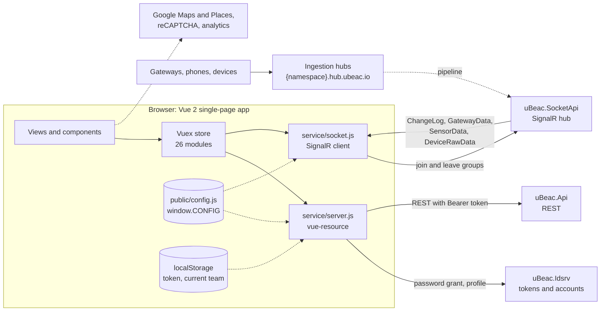
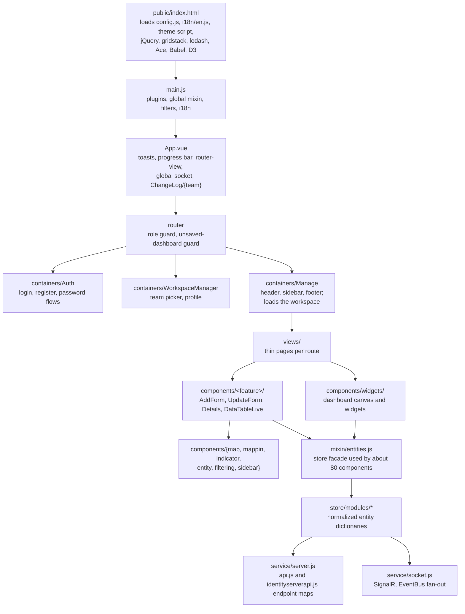
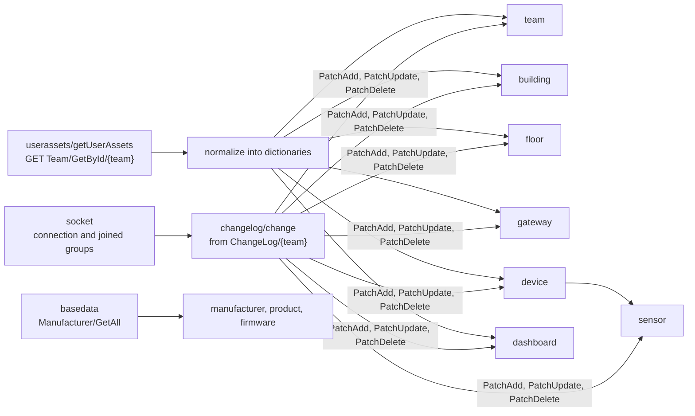
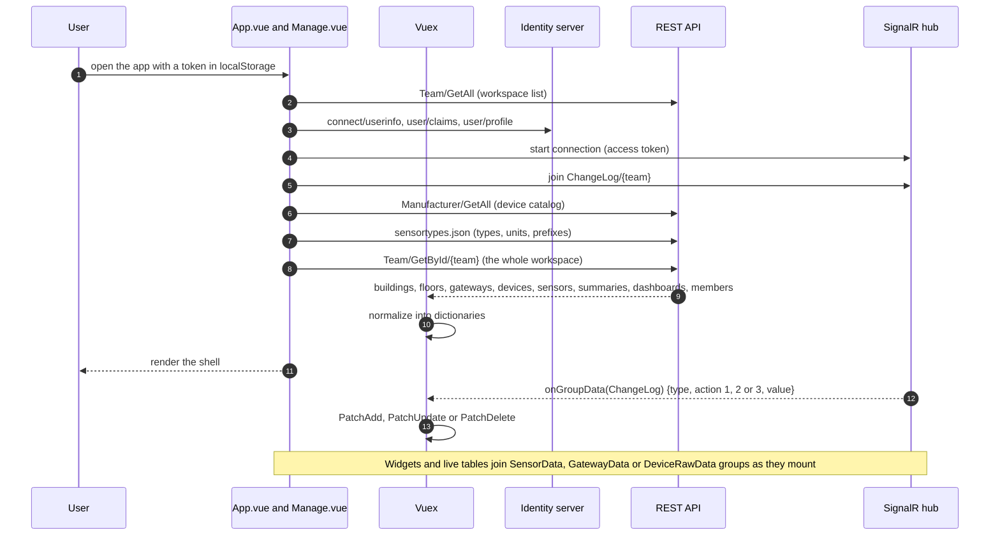
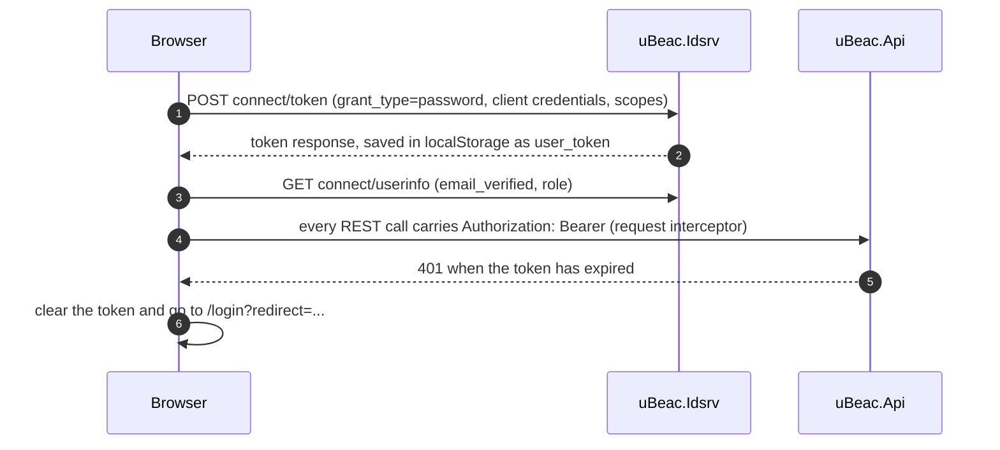
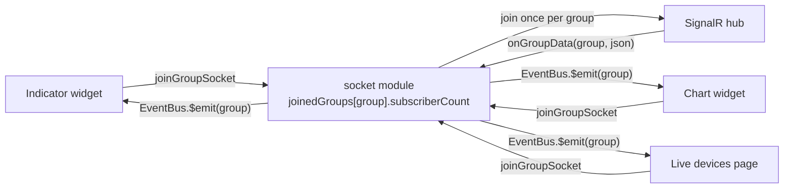
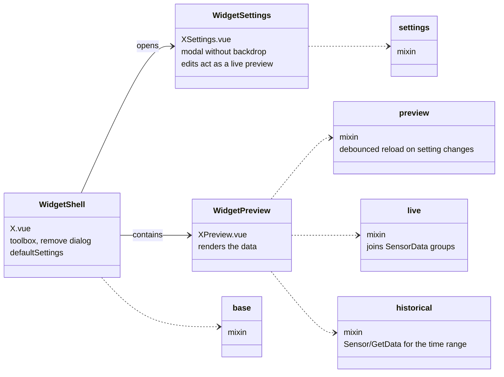
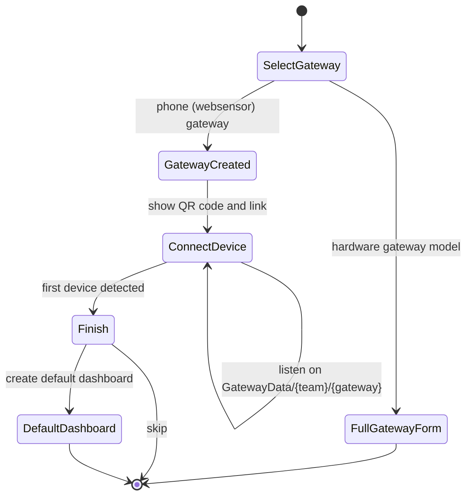
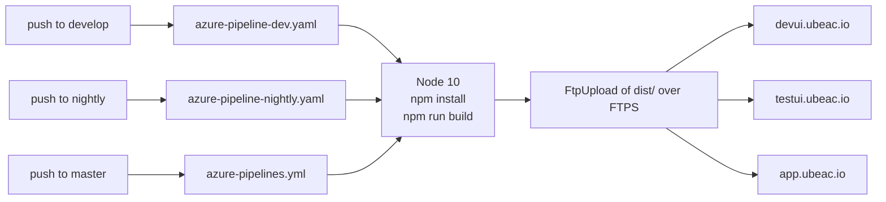

# uBeac IoT Platform: Web App (`ui.ubeac.io`)

The customer-facing web app of uBeac, served at `app.ubeac.io`. Users sign up, create a team, connect gateways, watch their devices report live, place them on building floor plans, and build real-time dashboards with drag-and-drop widgets.

Created by [Momentaj](https://momentaj.com/), a Toronto AI engineering firm.

> **Status: retired, published for reference.** The app's changelog runs from v0.0.1 (August 2018) to v1.0.3 (June 2020). The hosted service has been retired, and the source is published here under the MIT license. It is a Vue 2 codebase, which is past end of life. **Read [Known limitations and security notes](#16-known-limitations-and-security-notes) before running it.**

| Repository | What it is |
|---|---|
| [api.ubeac.io](https://github.com/ubeac/api.ubeac.io) | .NET backend: ingestion hubs, processing workers, REST API, identity, real-time. **Start there for the platform architecture and the comparison with other IoT platforms.** |
| **[ui.ubeac.io](https://github.com/ubeac/ui.ubeac.io)** (this repo) | Vue customer web app |
| [admin.ubeac.io](https://github.com/ubeac/admin.ubeac.io) | The first operator console and UX prototypes (2017 to 2018), later absorbed into this app |
| [OSMonitoring](https://github.com/ubeac/OSMonitoring) | Edge agent: a computer's own sensors (CPU, memory, disks, network, temperatures) as a uBeac device |
| [SBCGateway](https://github.com/ubeac/SBCGateway) | Edge agent: a Raspberry Pi as a BLE, Bluetooth and Wi-Fi scanning gateway |

## Contents

1. [At a glance](#1-at-a-glance)
2. [Feature tour](#2-feature-tour)
3. [What sets it apart](#3-what-sets-it-apart)
4. [Tech stack](#4-tech-stack)
5. [High-level architecture](#5-high-level-architecture)
6. [Application architecture](#6-application-architecture)
7. [Boot and live synchronization](#7-boot-and-live-synchronization)
8. [Authentication](#8-authentication)
9. [Real-time subscriptions](#9-real-time-subscriptions)
10. [Dashboards and the widget system](#10-dashboards-and-the-widget-system)
11. [Onboarding wizard](#11-onboarding-wizard)
12. [Routes and backend endpoints](#12-routes-and-backend-endpoints)
13. [Project structure](#13-project-structure)
14. [Getting started](#14-getting-started)
15. [Build and delivery](#15-build-and-delivery)
16. [Known limitations and security notes](#16-known-limitations-and-security-notes)
17. [History](#17-history)
18. [License](#18-license)

---

## 1. At a glance

| | |
|---|---|
| **Framework** | Vue 2.6, Vuex 3, vue-router 3, Vue CLI 3 (webpack 4) |
| **UI shell** | CoreUI admin layout on Bootstrap 4.2 and bootstrap-vue |
| **Size** | 234 Vue components, 26 Vuex modules, about 59,000 lines of Vue, JavaScript and SCSS |
| **Real time** | One SignalR connection per browser tab, with reference-counted group subscriptions |
| **Dashboards** | Drag-and-drop grid, 6 widget types, 19 animated indicators, 4 themes |
| **Maps** | Google Maps for outdoor locations, Leaflet for indoor floor plans |
| **Releases** | 256 versions, August 2018 to June 2020 |

## 2. Feature tour

- **Onboarding in minutes.** A wizard walks a new user from sign-up to a live dashboard: pick a gateway type, scan a QR code to turn a phone into a gateway, watch the first device appear live, and get a dashboard generated for it.
- **Teams (workspaces).** Each team has a unique namespace, which becomes its ingestion address. Members are added by email with `View` or `Admin` access, and admins can issue API tokens for programs.
- **Buildings and floors.** Buildings have an address and a map location (Google Places autocomplete). Floors have an uploaded floor-plan image, and gateways and devices are pinned onto it.
- **Gateways.** Pick a model from the device catalog, choose a URL, and copy the ready-made HTTP and MQTT endpoints. Security settings cover HTTPS-only, required headers, MQTT username and password, TLS, and IP allow and deny lists. Each gateway has a **live request inspector** showing every incoming request, its raw body (as JSON, YAML, XML, HTML or raw text), the decoded devices and any decoder errors.
- **Devices and sensors.** Devices appear automatically from gateway traffic. A **Live devices** view lists everything the gateways can hear, including unregistered beacons; adding one opens a device form prefilled from its live data. Each sensor has a type, unit and SI prefix, plus display settings: icon, color, decimal precision and **color ranges** for thresholds.
- **Dashboards.** A 12-column drag-and-drop grid with Indicator, Chart, Gauge, Map, Floor plan and custom-code (Raw) widgets. Widgets combine live data with history, and dashboards can switch between light and three dark themes.
- **Reports.** Sensor data and gateway request history, filterable by device, sensor, gateway and date range, with CSV and JSON export.
- **Platform admin.** Operators manage the device catalog (manufacturers, products and firmware, including decoder code) from the same app.

## 3. What sets it apart

The web app is where the platform's design choices become visible to a user. Compared with the general-purpose IoT consoles of its time:

- **The debugging loop is built in.** Most IoT consoles show data only after it has been parsed successfully. uBeac shows every raw request next to its decoded result and any decoder exception, live, so a user can see why a device isn't showing up without opening a log console.
- **Indoor first.** Buildings, floors and positioned devices are core screens, and the Floor widget puts live sensor values on the uploaded plan. A floor plan isn't a custom add-on.
- **Presentation metadata lives on the sensor.** A sensor's icon, color, precision and color ranges are set once and reused by every indicator, gauge, map pin and table. Dashboards stay consistent without per-widget configuration.
- **Nothing polls.** The app loads a team's whole workspace in one call, then keeps it current from a server-pushed change feed. When a teammate adds a device, it appears in every open browser.
- **An escape hatch for custom visuals.** The Raw widget lets a user write a small Vue component, with access to live and historical data, directly in the dashboard.
- **From a phone to a dashboard in two minutes.** New users don't need hardware to see the platform working.

The platform-level comparison with AWS IoT Core, Azure IoT Hub, ThingsBoard, Ubidots and ThingSpeak is in the [backend README](https://github.com/ubeac/api.ubeac.io#2-why-ubeac-how-it-compares).

## 4. Tech stack

| Purpose | Libraries |
|---|---|
| Framework | Vue 2.6, Vuex 3.1, vue-router 3.0 (history mode), vue-i18n 8 |
| Build | Vue CLI 3.4 (webpack 4), Babel, node-sass 4, ESLint (standard + vue), stylelint, lint-staged |
| UI | CoreUI layout (vendored SCSS), Bootstrap 4.2, bootstrap-vue 2.5, Font Awesome 5, a custom 168-glyph icon font (`ubeacons`) |
| HTTP | vue-resource with declarative endpoint maps and interceptors |
| Real time | `@microsoft/signalr` 3.1 over WebSockets |
| Charts | Highcharts 6.2 (stock, solid gauge), D3 v3 for one animated indicator |
| Maps | Google Maps with Places (`vue2-google-maps`), Leaflet 1.6 with marker clustering (`vue2-leaflet`) |
| Dashboard grid | gridstack.js with jQuery UI |
| Code editing | Ace editor; Babel standalone and a vendored copy of vuep for the Raw widget |
| Forms | vee-validate 2, vue-form-wizard, vue-multiselect, date pickers, color swatches |
| Utilities | lodash, moment, json2csv, QR code, clipboard, highlight.js |
| Analytics | Google Analytics (gtag), Hotjar |
| Tests | Mocha and Chai (unit), Nightwatch (end-to-end) |
| CI/CD | Azure Pipelines, FTPS deployment |

## 5. High-level architecture



The app talks to three backend services, all from the [api.ubeac.io](https://github.com/ubeac/api.ubeac.io) repository. It never polls. It reads the workspace once over REST and then relies on SignalR for every change.

## 6. Application architecture



| Layer | Folder | Responsibility |
|---|---|---|
| Containers | `src/containers` | Page shells: authentication, workspace picker, and the main layout that loads team data |
| Views | `src/views` | One thin component per route that wires route parameters to feature components |
| Feature components | `src/components/<feature>` | Forms, detail pages, live tables and pickers for each entity |
| Widgets | `src/components/widgets` | Dashboard canvas and the widget types |
| Mixins | `src/mixin` | Store facade (`entities.js`), socket lifecycle (`socket.js`), CRUD page scaffolding, global helpers |
| Store | `src/store` | 26 namespaced Vuex modules |
| Services | `src/service` | REST client and endpoint maps, authentication, local storage, SignalR |
| Runtime config | `public/config.js`, `public/i18n`, `public/themes` | Loaded as scripts before the bundle, so one build serves every environment |

### 6.1 State management

The workspace is kept **normalized**: the `team`, `building`, `floor`, `gateway`, `device` and `sensor` modules each hold a dictionary of entities by ID, and relationships are ID arrays (`floor.gateways`, `device.sensors`). Shared getters and mutations (`mixin/storeGetters.js`, `mixin/storeMutations.js`) give every entity module the same `list`, `byId`, `PatchAdd`, `PatchUpdate` and `PatchDelete` operations.



## 7. Boot and live synchronization



## 8. Authentication



- **Registration** checks that the team namespace is free, shows a reCAPTCHA challenge, creates the account, signs in, creates the team and opens the onboarding wizard, all in one flow. (The identity server in this code doesn't check the reCAPTCHA response.)
- **Email verification**: until the address is confirmed, the avatar shows a badge and the Teams and Profile pages offer a "Resend email" button.
- **Password flows**: forgot password (email link to `/resetpassword?code=...&email=...`), reset, and change.
- **Route guard** (`src/router/modules/authValidator.js`): routes declare `meta.roles`. `*` is public, `?` is anonymous-only, and `AUTH` needs a token. Role-specific entries (`USERS`, `ADMINS`) drive the sidebar menu; the API enforces the actual permissions.

## 9. Real-time subscriptions

One SignalR connection is opened after sign-in. Components subscribe through `mixin/socket.js`, which joins a group, listens on an event bus under the group's name, and leaves on destroy. The store keeps a **reference count** per group, so ten widgets watching the same sensor share one server subscription, and all groups are re-joined automatically after a reconnect.



| Group | Joined by | Used for |
|---|---|---|
| `ChangeLog/{team}` | `App.vue` | Entity changes that patch the store |
| `GatewayData/{team}/{gateway}` | Gateway live inspector, onboarding wizard | Raw requests with decoded devices and errors |
| `SensorData/{team}/{gateway or *}/{device or *}/{sensor or *}` | Widgets, device live tab, previews | Individual readings |
| `DeviceRawData/{team}/*/{device or *}` | Live devices page | Everything the gateways can hear, including unregistered devices |

## 10. Dashboards and the widget system

### 10.1 The canvas

`components/widgets/DashboardItem.vue` renders a dashboard on a **gridstack** grid (12 columns, 80-pixel rows). In edit mode, a side panel lists widget types; dragging one onto the grid creates it. Moving or resizing a widget writes its `x`, `y`, `w` and `h` back to the model, and **Save** sends the whole layout in one call (`Dashboard/UpdateWidgets`). The header also offers pause and resume for live updates, a theme picker and full-screen mode. Leaving with unsaved changes asks for confirmation.

### 10.2 Widget types

| Widget | Renders with | What it shows |
|---|---|---|
| **Indicator** | Animated SVG plus a Highcharts sparkline | The latest value with unit and device name, drawn as one of 19 indicators (battery, temperature, gas, lamp, fan, door lock, heart rate...). Hovering the sparkline shows past values ("time machine") |
| **Chart** | Highcharts Stock | Several named series with a sliding live window, preloaded from history. Line (optionally stepped), spline, column, bar, area and area-spline styles |
| **Gauge** | Highcharts solid gauge | A semicircle gauge colored by the sensor's color ranges |
| **Map** | Google Maps | Live positions of devices with location sensors, with custom pins, follow mode and dark map styles |
| **Floor** | Leaflet over the floor-plan image | Gateways and devices at their positions on the plan, with live sensor values in pop-ups |
| **Raw** | A user-written Vue component | Anything: the author edits a template, script and style in Ace, and the widget compiles it in the browser with access to live and historical data |

### 10.3 Anatomy of a widget

Every widget type is three components sharing mixins, so adding a type means writing three small files and registering it in `components/widgets/index.js`.



Sensors are chosen with shared pickers: one device and sensor for Indicator, Gauge and Raw; a list of named series for Chart; several devices, each with an optional "follow", for Map. The Floor widget picks a floor and shows every gateway and device placed on it.

## 11. Onboarding wizard

`/intro` is where every sign-in lands by default (`defaultRoute.afterLogin` in `config.js`), and the first page a new user sees (`components/gateway/AddFormWizard.vue`).



1. **Select a gateway.** Product cards come from the device catalog. Choosing the built-in phone gateway creates the gateway immediately; any other model opens the full gateway form.
2. **Connect a device.** The wizard shows a QR code and a link to the companion websensor web app, carrying the team namespace and gateway URL. The phone starts streaming its sensors, and the wizard unlocks **Next** as soon as the first device is detected live.
3. **Finish.** Optionally generate a dashboard from a template (battery, memory, acceleration, orientation and location widgets) bound to the phone's sensors.

## 12. Routes and backend endpoints

### 12.1 Routes

| Area | Paths |
|---|---|
| Authentication | `/login`, `/register`, `/logout`, `/forgotpassword`, `/resetpassword`, `/changepassword`, `/invalidaccess` |
| Workspace | `/` (team picker), `/team/new`, `/profile` |
| Onboarding | `/intro` |
| Dashboards | `/dashboards`, `/dashboards/new`, `/dashboards/:id`, `/dashboards/edit/:id` |
| Team settings | `/team/:id` (general, members, API tokens), `/team/details/:id` |
| Buildings and floors | `/building`, `/building/new`, `/building/:id`, `/building/details/:id`, `/building/floor/list`, `/building/floor/new`, `/building/floor/:id`, `/building/floor/details/:id` |
| Gateways | `/gateway`, `/gateway/new`, `/gateway/:id`, `/gateway/details/:id` |
| Devices | `/devices`, `/devices/new`, `/devices/:id`, `/devices/details/:id`, `/device/live-devices` |
| Reports | `/sensordata`, `/sensorchart`, `/gatewaydata` |
| Platform admin | `/manufacturer`, `/product`, `/firmware` (each with `/new` and `/:id`); `/AdminExec`, a raw database query console whose `Admin/*` endpoints are not in the released backend |
| Developer tools (admins) | `/kitchen/home`, `/kitchen/socket-test`, `/kitchen/editor` |

### 12.2 Backend endpoints

Endpoint URLs are declared in `src/service/api.js` and `src/service/identityserverapi.js` as URI templates, and vue-resource turns each entry into a method (`Server.AddGateway(body)`). File upload and download URLs are built in `components/FileUploader.vue`.

| Service | Endpoints used |
|---|---|
| REST API | `Team/*` (including `GetById`, the workspace aggregate, and API tokens), `Access/*`, `Building/*`, `Floor/*`, `Gateway/*` (including `GetData` and `Exists`), `Device/*`, `Sensor/*` (including `GetData`), `Dashboard/*` (including `UpdateWidgets`), `Manufacturer/*`, `Product/*`, `Firmware/*`, `File/Upload`, `File/Download/{id}`, `sensortypes.json` |
| Identity server | `connect/token`, `connect/userinfo`, `user/register`, `user/claims`, `user/profile`, `user/Update`, `user/GetUserProfileByEmail`, `user/changepassword`, `user/forgotpassword`, `user/resetpassword`, `user/resendemail` |
| SignalR hub | `join`, `leave`; events `onGroupData`, `onConnect`, `onJoin`, `onLeave` |

The backend README documents every endpoint in detail.

## 13. Project structure

```text
ui.ubeac.io/
├── public/
│   ├── index.html            Loads runtime config, translations, theme and global libraries
│   ├── config.js             Runtime configuration (window.CONFIG)
│   ├── i18n/en.js            English strings (window.i18n_en)
│   ├── themes/               Theme style sheets (CSS) and chart and map palettes (JS)
│   └── static/               Global libraries, images, icon fonts
├── src/
│   ├── main.js               Plugins and global registrations
│   ├── App.vue               Root: notifications, progress bar, global socket
│   ├── _nav.js               Sidebar menu
│   ├── containers/           Layouts: Auth, WorkspaceManager, Manage
│   ├── views/                Pages per route
│   ├── components/           Feature components, widgets, maps, indicators
│   ├── store/                Vuex store and 26 modules
│   ├── service/              REST client, endpoint maps, auth, SignalR
│   ├── mixin/                Store facade, socket lifecycle, CRUD scaffolding
│   ├── router/               Route modules and guards
│   ├── decorators/           @validation and @successNotification
│   ├── scss/                 CoreUI base, theme sources, component styles
│   ├── fonts/                Icon font sources (SVG glyphs, FontCustom config)
│   └── helpers/, filters/, directives/, events/, i18n/, config/
├── tests/                    Unit and end-to-end tests
├── azure-pipelines.yml       Production build and deploy
├── azure-pipeline-dev.yaml   Development build and deploy
├── azure-pipeline-nightly.yaml Test build and deploy
├── vue.config.js
└── CHANGELOG.md              Full release history
```

## 14. Getting started

### 14.1 Prerequisites

- **Node.js 10** (the version used in CI). node-sass 4.11 does not build on much newer versions.
- Only if you change themes or icons: the Ruby **Sass** CLI (`npm run theme`) and **FontCustom** with FontForge (`npm run fonticon`). The compiled outputs are already in `public/`.
- A running backend. See [api.ubeac.io](https://github.com/ubeac/api.ubeac.io#13-getting-started-local-development).

### 14.2 Configure

Edit `public/config.js`. It is loaded at runtime, so the same build works in every environment, and a deployed app can be re-pointed without rebuilding.

| Key | Meaning |
|---|---|
| `apiServerUrl` | REST API base URL, for example `http://localhost:60004/` |
| `identityServerURL` | Identity server base URL, for example `http://localhost:60000/` |
| `identityServerClientId`, `identityServerClientSecret` | OAuth client registered on the identity server |
| `socketURL` | SignalR hub URL, for example `http://localhost:55044/socket` |
| `gatewayUrlProtocol`, `gatewayUrlFirstPart` | Used to show each gateway's ingestion URL (`https://` and `hub.ubeac.io/`) |
| `websensorAddress` | Companion phone app used by the onboarding wizard |
| `googleMapKey`, `captchaSiteKey`, `gaCode` | Google Maps, reCAPTCHA and Google Analytics keys |
| `themes`, `map`, `colors`, `brandColors` | Dashboard themes, map styles and palettes |
| `defaultRoute`, `dateFormat`, `notification`, `nProgress`, `veeValidation` | Behavior settings |
| `docs` | Help links shown on forms |

### 14.3 Run

```bash
npm install
npm run serve        # development server on http://localhost:60001
npm run build        # production build to dist/
npm run lint         # ESLint
npm run stylelint    # stylelint with autofix
```

The development server has no proxy: the app calls the backend URLs from `config.js` directly, so the backend's `CorsOrigins` must include `http://localhost:60001`.

## 15. Build and delivery



Each branch deploys to its own site (site names from the pipelines' original FTP settings; production deploys with `clean: false`, the others with `clean: true`). The environment is chosen by the `config.js` committed on that branch; the pipelines don't substitute values. History-mode routing needs the web server to rewrite unknown paths to `index.html`.

**Theming.** Each dark theme (`src/scss/themes/dark-*.scss`) bundles CoreUI and Bootstrap again and recompiles the app's own styles with about 150 overridden variables, producing one CSS file of roughly 590 KB per theme. A matching `public/themes/*.js` sets the chart and map palettes. When a dashboard switches themes, the app loads both files at runtime and swaps them in.

## 16. Known limitations and security notes

This is a retired codebase, published to show how the product was built.

### Security

- **OAuth client secret in the browser.** The app uses the resource-owner password grant with a client secret, which is visible to anyone who opens the bundle. Before publication the secret was moved to `config.js` as a placeholder. A modern version should use authorization code with PKCE and no client secret.
- **Tokens in `localStorage`**, with no refresh and no revocation on logout.
- **The Raw widget runs user code in the app's origin.** A team member who can edit a dashboard can run script in every viewer's session. Sandbox it in a cross-origin iframe, or remove it.
- **Client-side roles aren't enforced by the route guard.** Admin screens rely on the API to reject non-admins.
- **Analytics.** Google Analytics receives the user's email as `user_id`, and Hotjar records every page, including the login form. Analytics IDs were replaced with placeholders before publication.
- **Deployment** uses FTPS with certificate validation turned off (`trustSSL: true`).

### Technical debt

- Vue 2, Vue CLI 3, node-sass, Ruby Sass and Node 10 are all end of life. Highcharts is commercially licensed and not covered by this repository's MIT license.
- About 20 declared dependencies are never imported, and global scripts (jQuery, gridstack, lodash, Ace, Babel standalone, D3) load on every page. There is no route-level code splitting.
- Most create, update and delete actions reload the whole workspace afterwards.
- Dead code includes unrouted asset-tracking views, the legacy `/card` page and `widget` store module, a hidden device simulator and `src/mock/`.
- The unit test imports a component that doesn't exist, and the end-to-end tests only take screenshots. CI runs neither.
- Known bugs: the app requests `sensortypes.json` while the API serves `SensorTypes.json` (a problem on case-sensitive hosts); `config.js` spells the theme key `cssCalss`, so the dashboard body gets a `theme-undefined` class; and the `/AdminExec` console calls `Admin/*` endpoints that the released backend doesn't have.

## 17. History

Highlights from [CHANGELOG.md](CHANGELOG.md), with the versions released in each period:

| Period | Versions | Highlights |
|---|---|---|
| August 2018 | 0.0.1 to 0.0.27b | First release: teams, buildings, floors, Leaflet floor maps, gateway request log with export |
| September 2018 | 0.0.28b to 0.0.57b | Drag-and-drop dashboards, indicator and chart cards, asset tracking, i18n |
| October 2018 | 0.0.59b to 0.0.78b | SignalR groups and live data tables, live devices, dashboard map card |
| November 2018 | 0.0.79b to 0.0.100b | Device management, sensor type, unit and prefix model, floor-plan dashboard card |
| December 2018 | 0.0.101b to 0.0.118 | Move to Vue CLI 3, custom icon font, shared store base; renamed Organization to Team, Card to Widget, Tag to Device; platform admin |
| January and February 2019 | 0.0.119b to 0.0.141b | Device simulator, socket authentication, Gauge widget, reCAPTCHA, gateway security |
| March to May 2019 | 0.0.142b to 0.0.172b | Google Analytics and Hotjar, CSV export, email verification, IP restriction, workspace selector |
| June to September 2019 | 0.0.173b to 0.0.224-beta | Historical data in widgets, dashboard themes, new indicators and color ranges, the new Floor-plan widget, Raw widget with live and historical data |
| October to December 2019 | 0.0.225-beta to 0.0.236-beta | Security tabs when adding a gateway, team selection from the URL, live-sync fixes for deletes, a UI polish pass across team and entity pages |
| February to April 2020 | 0.0.237-beta to 0.0.256-beta | SignalR client upgrade, map pins and Map widget settings, battery indicator, adding devices from the live list |
| May 2020 | 1.0.0 to 1.0.2 | New design, add-gateway wizard, first-time user flow, widget settings preview |
| June 2020 | 1.0.3 | Final release |

## 18. License

[MIT](LICENSE)
